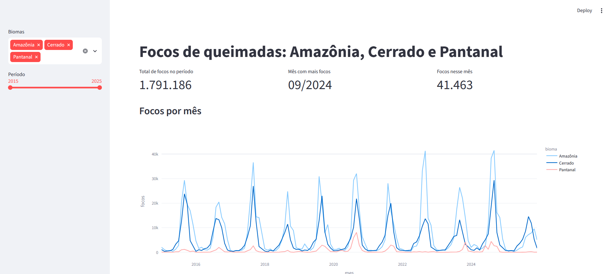
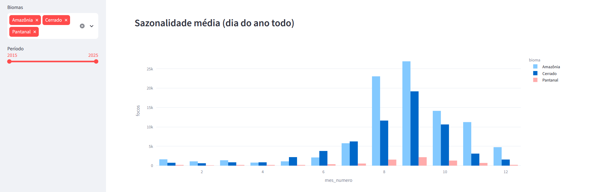

# 🔥 Queimadas nos biomas brasileiros: Amazônia, Cerrado e Pantanal

Análise e previsão de focos de queimadas a partir de dados abertos do INPE, comparando o comportamento de três biomas.

## Pergunta central

> É possível prever a quantidade mensal de focos de queimadas em cada bioma? O que pesa mais na previsão: o **histórico/sazonalidade** ou o **clima**?

## Dados

- **Fonte:** Programa Queimadas, INPE (dados abertos), focos de calor detectados por satélite.
- **Recorte:** biomas Amazônia, Cerrado e Pantanal; satélite de referência (evita contagem duplicada).
- **Período:** _definir_ (ex.: 2018 a 2025).
- Os dados brutos **não** ficam no repositório. Use `src/data_loader.py` para baixá-los.

## Metodologia

1. Coleta e limpeza dos focos
2. Agregação mensal por bioma
3. Análise exploratória e mapas (sazonalidade, tendência, diferenças entre biomas)
4. Modelagem: baseline sazonal ingênuo vs LightGBM (com lags, média móvel e sazonalidade)
5. Interpretação com SHAP
6. Dashboard em Streamlit

## Dashboard




Rode com `streamlit run app/streamlit_app.py` para explorar os dados de forma interativa.

## Resultados

_Preencha após a modelagem: tabela de métricas (baseline vs modelo), principais gráficos e aprendizados._

| Modelo | MAE (focos/mês)|
|---|---|
| Baseline sazonal | 3.506 |
| LightGBM | 2.702 |

Teste: jan/2024 a dez/2025, três biomas juntos. O LightGBM reduziu o erro médio em cerca de 23%.

## Como reproduzir

```bash
git clone <url-do-repositorio>
cd queimadas-biomas
python -m venv .venv && source .venv/bin/activate   # Windows: .venv\Scripts\activate
pip install -r requirements.txt

# 1) Ajuste src/config.py (URL dos CSVs e satélite de referência)
# 2) Rode os notebooks em notebooks/ na ordem
# 3) Suba o dashboard:
streamlit run app/streamlit_app.py
```

## Estrutura

```
├── data/          # raw/ e processed/ (ignorados pelo Git)
├── notebooks/     # narrativa da análise
├── src/           # código reutilizável (coleta, features, modelos)
├── app/           # dashboard Streamlit
├── tests/         # testes básicos
└── reports/       # figuras para o README
```

## Roadmap

- [ ] Coleta dos dados
- [ ] EDA e mapas
- [ ] Baseline + modelo de ML
- [ ] Interpretação (SHAP)
- [ ] Dashboard publicado
- [ ] Incluir dados de desmatamento (PRODES/DETER) como variável extra

## Autor

_Seu nome · LinkedIn · pós em Ciência de Dados_
