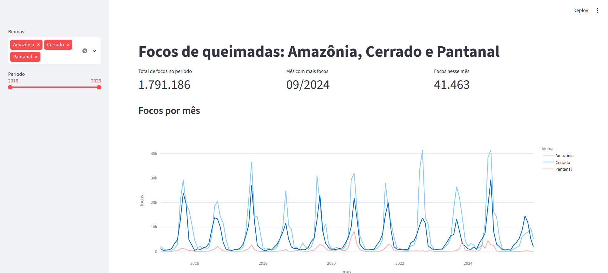
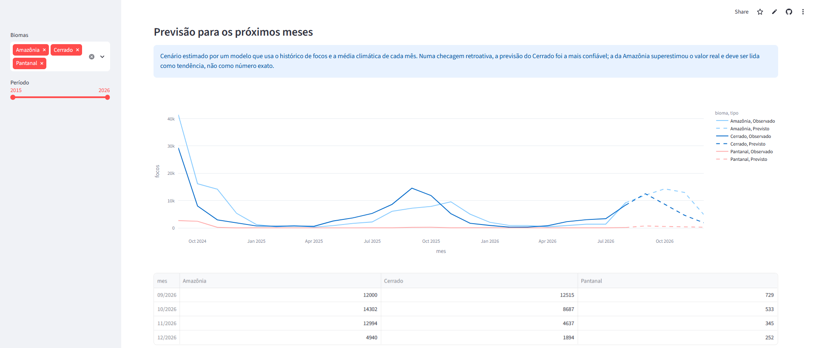
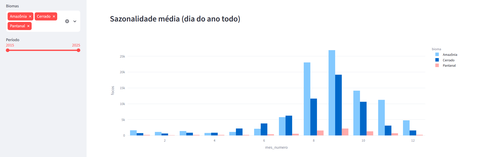
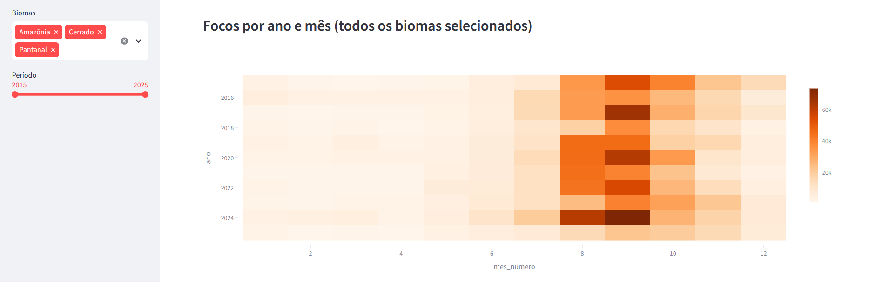

# 🔥 Queimadas nos biomas brasileiros: Amazônia, Cerrado e Pantanal

Análise e previsão de focos de queimadas a partir de dados abertos do INPE, comparando o comportamento de três biomas.

🔗 **[Ver dashboard](https://queimadas-biomas.streamlit.app)**

## Pergunta central

> É possível prever a quantidade mensal de focos de queimadas em cada bioma? O que pesa mais na previsão: o **histórico/sazonalidade** ou o **clima**?


## Dados

- **Fonte:** Programa Queimadas, INPE (dados abertos), focos de calor detectados por satélite.
- **Recorte:** biomas Amazônia, Cerrado e Pantanal; satélite de referência (evita contagem duplicada).
- **Período:** 2015 a agosto de 2026. Os anos de 2015 a 2025 vêm dos arquivos anuais do INPE; 2026 vem dos arquivos mensais, filtrando o satélite de referência (AQUA_M-T) para manter a série comparável.

## Metodologia

1. Coleta e limpeza dos focos
2. Agregação mensal por bioma
3. Análise exploratória e mapas (sazonalidade, tendência, diferenças entre biomas)
4. Modelagem: baseline sazonal ingênuo vs LightGBM (com lags, média móvel e sazonalidade)
5. Coleta de clima (temperatura e chuva) via NASA POWER, e comparação entre um modelo só com histórico e outro com histórico + clima
6. Interpretação com SHAP
7. Dashboard em Streamlit
8. Previsão dos meses seguintes (set–dez/2026), com checagem retroativa para medir a confiabilidade

## Dashboard

🔗 **[Acesse o dashboard publicado](https://queimadas-biomas.streamlit.app)**






Rode com `streamlit run app/streamlit_app.py` para explorar os dados de forma interativa.

## Resultados

| Modelo | MAE (focos/mês)|
|---|---|
| Baseline sazonal | 3.506 |
| LightGBM | 2.702 |

Teste: jan/2024 a dez/2025, três biomas juntos. O LightGBM reduziu o erro médio em cerca de 23%.

## Resposta à pergunta do projeto

O histórico (sazonalidade e meses recentes) explica a maior parte da variação nos focos de queimadas (~89% da influência, segundo SHAP). O clima (temperatura e chuva) contribui de forma real, mas menor (~11%), reduzindo o erro médio de previsão em cerca de 8%. Isso acontece porque o padrão sazonal já embute, de forma indireta, boa parte do efeito do clima.

## Previsão para o resto de 2026

Com os dados observados até agosto de 2026, o modelo estima os focos de setembro a dezembro:

| Bioma | Total previsto (set–dez/2026) | Mês de pico |
|---|---|---|
| Amazônia | ~44 mil | Outubro |
| Cerrado | ~28 mil | Setembro |
| Pantanal | ~1,9 mil | Setembro |

**Como ler esses números:** o clima dos meses futuros é desconhecido, então o modelo usa a média histórica de cada mês, e cada previsão alimenta a seguinte, o que faz o erro crescer. Numa checagem retroativa (previsão feita em agosto de 2025 para set–dez/2025), o modelo errou menos que a regra "igual ao mesmo mês do ano anterior" nos três biomas, mas superestimou a Amazônia em mais que o dobro. A previsão do Cerrado é a mais confiável; a da Amazônia deve ser lida como um cenário possível, não como valor esperado.

## Como reproduzir

```bash
git clone <url-do-repositorio>
cd queimadas-biomas
python -m venv .venv && source .venv/bin/activate   # Windows: .venv\Scripts\activate
pip install -r requirements.txt

# 1) Coloque os CSVs anuais (2015–2025) e os mensais de 2026 em data/raw/ e data/raw/2026/
# 2) Rode os notebooks em notebooks/ na ordem
# 3) Suba o dashboard:
streamlit run app/streamlit_app.py
```

## Estrutura

```
├── data/          # raw/ e processed/ (ignorados pelo Git)
├── notebooks/     # narrativa da análise
├── src/           # código reutilizável (coleta, features, modelos)
├── app/           # dashboard Streamlit
├── tests/         # testes básicos
└── reports/       # figuras para o README
```

## Roadmap

- [x] Coleta dos dados
- [x] EDA e mapas
- [x] Baseline + modelo de ML
- [x] Interpretação (SHAP)
- [x] Dashboard publicado
- [x] Incluir dados de clima (NASA POWER) como variável extra
- [x] Previsão dos próximos meses (set–dez/2026)

## Autor

Estefane Andrade